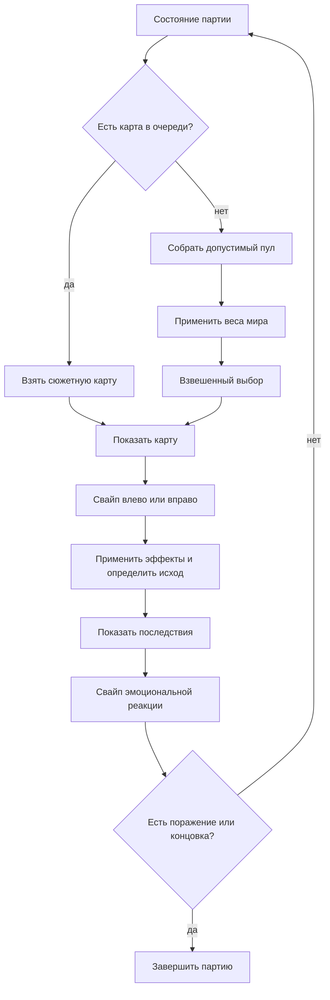

# Архитектура игры

## Главный принцип

Игра разделена на две части:

1. **Движок** знает, как проверить условия, изменить состояние, выбрать следующую карту, показать интерфейс и завершить партию.
2. **Контент** описывает, что написано на картах, когда они допустимы и что делают варианты ответа.

Автор контента не пишет JavaScript-логику. Он комбинирует небольшой словарь условий и эффектов в `src/content.js`. Схема достаточно выразительна для обычных происшествий, сюжетных развилок, глобальных событий и концовок.

## Состояние партии

Единственный объект `state` содержит:

- `turn` — номер хода;
- `resources` — четыре нормализованных значения от 0 до 1;
- `flags` — сюжетные факты, например `mirror_adviser: true`;
- `counters` — числовой прогресс, например число отданных контейнеров;
- `queue` — обязательные следующие карты;
- `history`, `playCounts`, `lastPlayed` — память селектора;
- `currentCardId` — карта на экране;
- `phase` — `situation` или `aftermath`;
- `aftermath` — текст выбранного результата и две реакции;
- `pendingOutcome` — поражение или концовка, отложенные до прочтения последствий;
- `ended` — результат завершённой партии.

Состояние автоматически сохраняется в `localStorage`. Перезагрузка страницы продолжает партию с той же карты. Версия контента входит в ключ сохранения: при несовместимом изменении данных достаточно увеличить `GAME_CONTENT.version`.

## Двухтактная карточка

Каждый игровой ход состоит из двух фаз:

1. `situation` — игрок читает происшествие, оценивает скрытое влияние на ресурсы и принимает решение;
2. `aftermath` — движок уже применил эффекты, но показывает авторский результат и две ролевые реакции.

Свайп результата не выбирает следующую карту: оба направления завершают текущий ход. Реакция сохраняется в состоянии и при желании может содержать обычные эффекты. Следующая ситуация выбирается только после этой фазы.

Если основное решение вызвало поражение или концовку, исход хранится в `pendingOutcome`. Финальный экран появится после свайпа результата, поэтому причинно-следственная сцена никогда не теряется.

## Селектор карт — «новый мешок каждый ход»

На каждом ходу `selectNextCard()` выполняет одинаковый конвейер:

1. **Приоритетная очередь.** Если сюжет ранее поставил карты в `queue`, берётся первая допустимая карта. Это создаёт линейные и ветвящиеся эпизоды.
2. **Фильтры смысла.** Из общего пула удаляются карты, чьи `conditions` ложны, исчерпавшие `maxPlays`, находящиеся на `cooldown` или недавно показанные.
3. **Базовые веса.** Каждая допустимая карта начинает с собственного `weight`.
4. **Состояние мира.** `tagRules` умножают вес тематических карт. Например, при низком бюджете карты с тегом `budget` встречаются чаще.
5. **Локальные модификаторы.** Необязательные `weightModifiers` конкретной карты уточняют её вероятность.
6. **Взвешенный выбор.** Случайность остаётся, но работает только внутри осмысленного пула.

Если маленький тестовый набор исчерпал все кулдауны, движок один раз ослабляет только запрет повторов. Сюжетные условия и `maxPlays` всё равно соблюдаются.

### Почему не нужен заранее заполненный мешок

Заранее составленный список быстро устаревает после каждого выбора. Пересборка пула на каждом ходу дёшева даже для тысяч карт, зато немедленно учитывает новые флаги, ресурсы и фазы событий.

## Сюжетные цепочки

Сюжет запускается обычной картой с условием. Её выбор может:

- поставить одну или несколько карт в начало `queue`;
- установить флаг ветки;
- изменить ресурсы и счётчики;
- очистить очередь;
- немедленно завершить игру.

В демо цепочка `glass_signal_01` → `glass_signal_02` расходится на две финальные карты. После одного варианта открывается повторяемая карта `mirror_tip`. Это пример долгосрочного последствия выбора.

Для большого события вроде «войны» достаточно флага `war_active`. Он:

- входит в `conditions` военных карт, поэтому вне войны они исчезают;
- включает `tagRule` с тегом `war`, делая их частыми;
- может запускать обязательные этапы через `queue`;
- выключается эффектом финальной карты события.

## Ресурсы и баланс

Все ресурсы хранятся в нормализованной шкале `0..1`, стартуют не в центре и имеют разное направление угрозы. Эффект `0.08` равен 8% полной шкалы, поэтому баланс не зависит от формата представления:

- персонал, бюджет и секретность опасны при падении до 0;
- аномальность опасна при росте до 1.

Во время свайпа показывается текст решения. Затрагиваемые ресурсы получают нейтральные кружки: размер отражает абсолютную силу эффекта, но цвет и знак не сообщают его направление. Игрок видит степень риска, однако должен сам выводить последствия из смысла решения.

Текущие числа — демонстрационные. Для баланса стоит позже собирать телеметрию симуляций: средняя длина партии, причины поражений, частота карт, ценность каждого выбора и достижимость концовок.

## Условия

Движок поддерживает:

- `resource` — сравнение ресурса;
- `turn` — сравнение номера хода;
- `flag` — значение сюжетного флага;
- `counter` — сравнение счётчика;
- `played` — число показов карты;
- `all`, `any`, `not` — композицию условий.

Операторы сравнений: `lt`, `lte`, `eq`, `neq`, `gte`, `gt`.

## Эффекты

Поддерживаются:

- `resource` — изменить ресурс;
- `flag` — записать сюжетный факт;
- `counter` — изменить числовой прогресс;
- `enqueue` — поставить карты в очередь;
- `clearQueue` — отменить оставшуюся цепочку;
- `end` — немедленно показать авторскую концовку.

Новые типы условий и эффектов добавляются централизованно в `testCondition()` и `applyEffect()`.

## Представление и публикация

Проект намеренно использует HTML, CSS и JavaScript без фреймворка:

- нет загрузки библиотек и зависимости от сети;
- исходники открываются напрямую через `index.html`;
- свайп реализован через Pointer Events и одинаково работает с мышью и касанием;
- клавиши ←/→ дают дополнительный способ ввода на компьютере;
- для публикации каталог игры целиком загружается на статический хостинг или упаковывается в архив.

Если проект перерастёт примерно в 300–500 карт, контент разумно вынести в несколько тематических файлов и добавить валидацию схемы. Игровому ядру это архитектурное изменение не потребуется.

## Следующие разумные этапы

1. Зафиксировать тон и словарь мира.
2. Написать 40–60 базовых происшествий, чтобы перестали срабатывать ослабленные кулдауны.
3. Добавить 3 сюжетные линии по 5–8 карт и 4–6 концовок.
4. Расширить структурный валидатор анализом недостижимых карт.
5. Добавить headless-симулятор тысяч партий для первичной балансировки.
6. Заменить абстрактные фоны карт на иллюстрации, не смешивая графику с игровыми данными.
